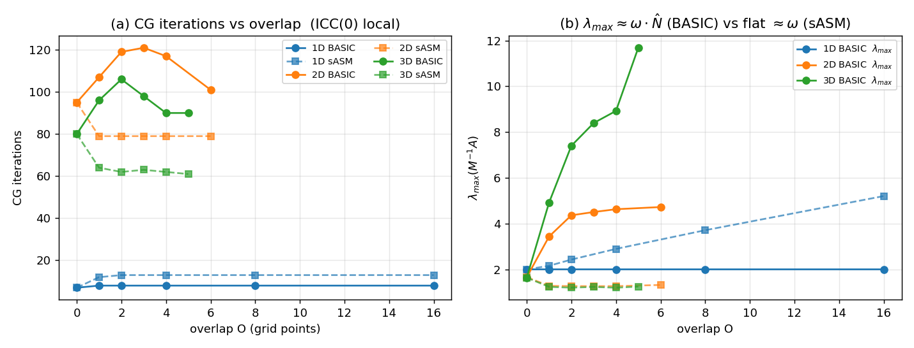
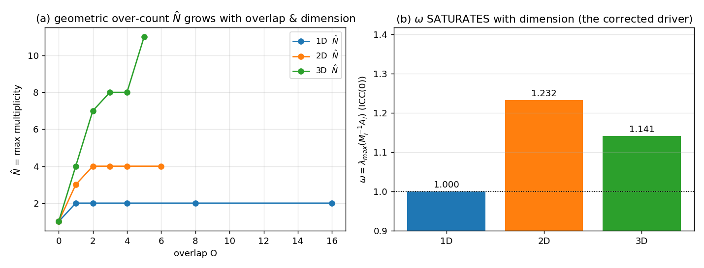
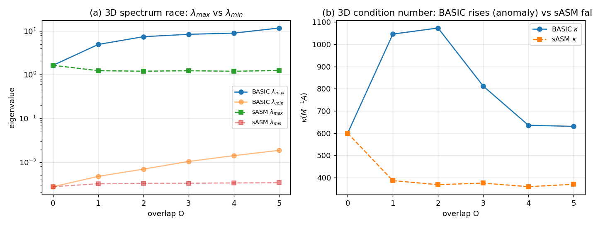
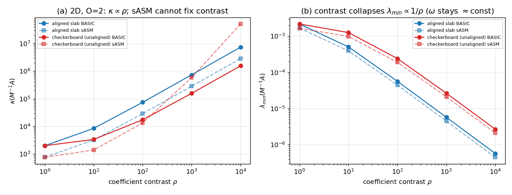
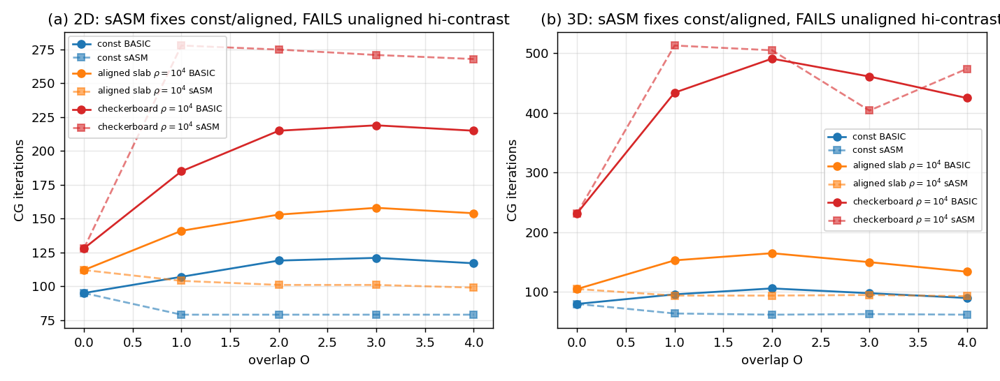

# 不精确局部解下加性 Schwarz「重叠反常」的维度与变系数研究

*An interpretability study of the overlap–iteration anomaly of unscaled additive
Schwarz + CG with inexact (ICC) local solves, across dimension and coefficient.*

工作目录 `asm_bug_demo/dim_var/`，全部用 **PETSc 3.24**（本机 Homebrew 3.24.6 /
HPC spack 3.24 同系列）。NumPy/SciPy 参考实现 `asm_spectral.py` 给出**精确谱**，
作为 PETSc Lanczos 估计的交叉校验（1D 两者逐位一致）。

---

## 摘要

已确立的现象：在 SPD Laplace 上用 `CG + PC_ASM_BASIC（未加权经典加性 Schwarz）+
ICC 不精确局部解`，**迭代数随重叠 O 增加而上升**，与经典 Schwarz 理论相反。本文把它
放到 **1D→2D→3D** 与 **变系数 `-∇·(a(x)∇u)`** 两个轴上做受控测量（迭代数、精确谱
λmax/λmin/κ、几何重数 N̂、不精确放大因子 ω），得到三条结论：

1. **现象随维度增强**（1D 无、2D 中、3D 强），但**驱动项不是局部解变差**：直接测得
   `ω = λmax(M_i⁻¹A_i)` 在 1D/2D/3D 分别 **1.000 / 1.232 / 1.141**——**饱和、且 3D 比 2D 还小**。
   真正指数级随维度放大的是**几何重数** `N̂ = m_axis^d`（角点共享 2^d、3^d…）。
   分解 `λmax(BASIC) ≈ ω·N̂` 中，ω 决定「**是否**出现反常」，N̂ 决定「**随维度多强**」。
2. **1D 双重免疫**：ICC(0) 在三对角阵上**精确**（ω≡1，连对比度 10⁴ 也是），且 N̂ 仅线性增长。
3. **变系数下反常持续并被放大**；系数**只经 λmin 进入**（`κ∝ρ`、`λmin∝1/ρ`），不动 ω、不动 N̂。
   `D^{-1/2}` 加权（sASM）在 const/smooth/对齐跳变/中等对比度下**修复反常**，但在
   **高对比度且不对齐**时**反而更差**——这正是「廉价的几何修复失效、必须上谱粗空间(GenEO)」的边界。

---

## 1. 问题与背景

### 1.1 现象
cardioid 的 `Sys2 (u_e Recovery)` / `Sys3 (Torso)` 求解（CG + PCASM BASIC + ICC）出现
重叠越大迭代越多、Sys3 直接撞 `max_it`。先前工作（`README_ASMCG_DEMO.md`）已用 MFEM 与
独立 pure-PETSc 两套装配 **逐位一致** 复现，排除代码 bug。本研究回答：**为什么、为什么是 3D、变系数会怎样。**

### 1.2 经典理论（必须区分「证明了什么」与「我们处在哪」）
单层加性 Schwarz 的条件数界
`κ(M_ad⁻¹A) ≤ C(1+H/δ)`（Dryja–Widlund；Toselli–Widlund 2005 Thm 3.13），等价着色形式
`κ ≤ C₀²·ω·(N_c+1)`。要点：

- 该界**与维度无关（形式上）**，且 3D 被充分研究（FETI-DP/BDDC、GenEO-3D）。
- 重叠的好处**全在 λmin 一侧**（`C₀²≤C(1+H/δ)` 随 δ 减小）；λmax 由着色数控制、**对重叠不敏感**。
- **关键缺口**：该界假设**精确局部解**或**加权(partition-of-unity)算子**。它**并不覆盖**
  「未加权 BASIC + 定填充不精确 ICC」这一组合——而这正是我们（与 cardioid）所处的角落。

### 1.3 为什么少有人撞到（H1 评判：一半对、一半需修正）
- **对（且有据）**：RAS（Cai–Sarkis 1999）是 PETSc 的**默认** `pc_asm_type`（源码
  `asm.c:1284` `osm->type=PC_ASM_RESTRICT`，`asm.c:1239` 明确提示 restrict≠basic）。RAS
  非对称→配 GMRES/BiCGStab、自带 partition-of-unity，**结构上不 over-count**，所以主流用户
  撞不到。cardioid 为给 CG 保对称性强行 `-pc_asm_type basic`，正好走进无人看守的角落。
- **需修正**：「研究主要在 1D/2D、3D 没人做」**过强**。3D DD 理论成熟；真正空白是
  `{未加权 BASIC}×{CG}×{定填充不精确 ICC}×{无粗空间}` 这个**窄角落**，而它在 3D 更严重是
  **几何原因**（N̂=m_axis^d，下文），不是算力原因。

---

## 2. 方法

工具 `schwarz_lab.c`（PETSc）+ 参考 `asm_spectral.py`（NumPy 精确谱）。

- **算子**：`-∇·(a(x)∇u)=1`，`[0,1]^d`，x0=0 面 Dirichlet（对称消元保 SPD），其余 Neumann；
  守恒型顶点中心差分 + 面系数**调和平均**，故 a≡1 退化为标准 (2d+1) 点 Laplace（与旧
  `pure_petsc_demo.c` 一致）。
- **子域**：S^d 规则盒子，显式经 `PCASMSetLocalSubdomains` 交给 PETSc（子域数独立于 MPI 进程，
  受控研究用 `-n 1` 串行），`PCASMSetOverlap(O)` 经 `MatIncreaseOverlap` 按**图距离**增长重叠。
- **局部解**：`-exact`(Cholesky) 或 ICC(L)。**变体**：scheme 0 = `CG+PCASM BASIC`；
  scheme 3 = `CG + PCSHELL sASM`（`M⁻¹=D^{-1/2}(Σ Rᵢᵀ A_i⁻¹ Rᵢ)D^{-1/2}`，D=diag(重数)）。
- **测量**：CG 迭代数；`λmax/λmin/κ(M⁻¹A)`（`KSPComputeExtremeSingularValues`，1D 与精确谱对齐）；
  N̂（重叠子域指示向量求和取 max）；`ω=max_i λmax(M_i⁻¹A_i)`（`MatCreateSubMatrices` 取 A_i 后小 KSP）。

注意：PETSc 的图距离重叠与「L∞ 盒环」重叠对 N̂ 的**增长速率**不同（前者更慢到达角点），本文以
**PETSc（图距离）**为准；两者机制相同，仅 N̂ 序列不同。

---

## 3. 结果

### 3.1 维度扫描（常系数，S=4；1D nx=257、2D nx=49、3D nx=25）

`schwarz_lab.c`，BASIC + ICC(0)：

| d | iter (O=0→…)        | λmax (O=0→…)            | ω      | N̂ (O=0→…) | 反常 |
|:-:|:--------------------|:------------------------|:-------|:-----------|:-----|
| 1 | 7→8→8→8→8→8         | 2.00→2.00（=N̂，平）     | 1.000  | 1→2→2…     | **无** |
| 2 | 95→107→119→121→117  | 1.66→3.43→4.36→…        | 1.232  | 1→3→4…     | **有(中)** |
| 3 | 80→96→**106**→98→90 | 1.64→4.9→7.4→8.4→11.7   | 1.141  | 1→4→7→8→11 | **强** |



*图1：(a) 1D BASIC 平、2D/3D BASIC 上升（反常）、sASM(虚线)更低且下降；
(b) λmax：3D BASIC 因 N̂ 过计数而爆，sASM 全部压平 ≈ ω≈1.2。*

### 3.2 修正后的机制（本文核心更正）

把 `λmax(M_BASIC⁻¹A) ≈ ω·N̂` 两个因子分开测：

- **ω 不随维度增大**：1.000 / 1.232 / 1.141，**饱和、3D<2D**，且与问题规模、重叠层数几乎无关。
  ω 是有界 O(1) 因子——它是「**开关**」（ω>1 才可能有反常；1D ω=1 故无），**不是**维度强度来源。
- **N̂ = m_axis^d 才是随维度的指数放大器**：面共享 2^d、二级邻居角共享 3^d（复现 2D 的 4→9）。
  纯几何、**与系数无关**。精确局部解时 `λmax = N̂` **严格成立**（实测 2,4,8,…）。



*图2：(a) N̂ 随重叠与维度增长；(b) ω 随维度**饱和**（修正了「ω 随维度增大」的直觉）。*

**净迭代由 λmax/λmin 的赛跑决定。** 3D 谱赛跑（图3）：BASIC 的 λmax 被 N̂ 抬升快于 λmin 改善
→ κ 上升（反常）；sASM 去掉 N̂ 后 λmax 压平 → κ 随重叠下降（修复）。



**一个诚实的细节**：不精确并非严格必要——精确解时 N̂ 是「平台+向上跳」，一次 N̂ 跳变
（如 3D 的 8→27）也能压过 λmin 改善而让迭代回升（NumPy 参考里 3D-exact: 39→29→38→39 可见）。

### 3.3 变系数（H3）

2D，O=2，ICC(0)，对比度 ρ 扫描（`schwarz_lab.c`，对高对比度块加 `positive_definite` shift）：

| coef | scheme | ρ=1 | ρ=10² | ρ=10⁴ | 说明 |
|:-----|:------:|:---:|:-----:|:-----:|:-----|
| 对齐 slab | BASIC κ | 2.0e3 | 7.5e4 | 7.4e6 | κ∝ρ |
| 对齐 slab | sASM κ  | 7.6e2 | 2.9e4 | 2.9e6 | sASM 一致更优 |
| checker(不对齐) | BASIC κ | 2.0e3 | 1.8e4 | 1.6e6 | |
| checker(不对齐) | sASM κ  | 7.7e2 | 1.3e4 | **5.1e7** | **高对比度时 sASM 反而更差** |

- **ω 与对比度无关**（始终 ≈1.23/1.14）；**系数经全局 λmin 进入**：`λmin∝1/ρ`、`κ∝ρ`
  （经典单层 Schwarz 对高对比度的失败，与 N̂、ω 无关）。



- **重叠反常在变系数下持续并被放大**（2D, ρ=10⁴, O=0→4 的迭代）：

| coef (2D, ρ=10⁴) | BASIC | sASM | sASM 评判 |
|:-----------------|:------|:-----|:----------|
| const            | 95→**119** ↑ | 95→**79** ↓ | **修复** |
| 对齐 slab        | 112→**158** ↑ | 112→**99** ↓ | **修复** |
| 不对齐 slab      | 121→**148** ↑ | 121→**97** ↓ | **修复** |
| checker(不对齐)  | 128→**219** ↑ | 128→**278** ↑↑ | **失效，比 BASIC 还差** |



*图5（核心）：sASM(虚线) 对 const/对齐/中对比度压在 BASIC 之下（修复反常），
但对**不对齐高对比度** checkerboard 升到 BASIC 之上（**失效**）——2D、3D 皆然。*

**为什么 sASM 在这里失效**：`D^{-1/2}` 是**几何**（按重数）的 partition-of-unity，**系数盲**。
当系数跳变穿过重叠区里的子域界面时，几何权重给出了「错误」的单位分解，比均匀 BASIC 更糟。
此处需要**系数感知的谱权重/粗空间（GenEO）**。

---

## 4. 结论：对三条判断的评判

| 判断 | 评判 | 依据 |
|:-----|:-----|:-----|
| **H1** 现象因主流转向 RAST 而被忽视、且在 3D 才显现 | **一半对、一半需修正** | RAS=PETSc 默认、非对称→GMRES、不 over-count，确实让主流撞不到（对）；但「3D 没人研究」过强——空白是 BASIC+CG+不精确 ICC+无粗空间这个窄角落，且其 3D 更严重是几何原因（中等置信） |
| **H2** 反常随维度增强，因 overlap 区域增大使局部解变差(ω↑) | **结论对、机制错** | 反常随维度增强（对）；但实测 ω **饱和**(1.0/1.23/1.14)、3D<2D，**不是** ω 在驱动；真正驱动是几何过计数 **N̂=m_axis^d**（高置信） |
| **H3** 变系数未被研究、1D→3D 行为可能不同 | **大体对、需细化** | 该交叉确属空白（中置信）；系数经 **λmin**(∝1/ρ) 进入、不动 ω/N̂；1D 对任何系数免疫；sASM 修复趋势但**高对比度不对齐时失效**→需 GenEO（这是最强、可发表的边界结论） |

### 新意（与教科书的界线）
- **教科书（须引用、非新）**：RAS 起源/性质（Cai–Sarkis 1999；Efstathiou–Gander 2003）；
  BASIC 过计数 `λmax≤N_c+2`、加权修复（Smith–Bjørstad–Gropp 1996；Toselli–Widlund 2005 Thm 2.7）；
  `κ≤C(1+H/δ)` 在 λmin 侧、维度无关（Dryja–Widlund）；1D 三对角 ICC(0) 精确（Saad 第10章）；
  高对比度需粗空间、不对齐最坏（GenEO, Spillane 2014；Graham–Lechner–Scheichl 2007）。
- **本文的新（窄、实证、非新定理）**：① 对称 BASIC+CG+定填充 ICC 下**迭代随重叠单调上升**这一现象
  （文献一致报告相反）；② 经验**近等式** `λmax≈ω·N̂`（教科书只给不等式），用 1D-ICC(0)-精确（ω=1）
  隔离出纯几何 N̂；③ **维度归因的更正**：ω 饱和、N̂=m_axis^d 才是指数驱动（推翻「ω 随维度增大」直觉）；
  ④ **sASM 的系数盲边界**：几何加权对所有系数修复重叠趋势，但高对比度不对齐时失效、必须换谱粗空间。
- 注意：新意=「聚焦检索未见在先工作」，非「首次发现」之证明。

---

## 5. 复现

```bash
cd asm_bug_demo/dim_var
# 本机：已 brew upgrade petsc 到 3.24.6（与 HPC spack 3.24 同系列）
PETSC_DIR=/opt/homebrew/opt/petsc
mpicc -O2 -I$PETSC_DIR/include schwarz_lab.c -o schwarz_lab -L$PETSC_DIR/lib -lpetsc -lm

bash run_petsc.sh A      # 维度扫描（常系数）-> results/petsc_A.log
bash run_petsc.sh C      # 变系数（系数场 @1e4 + 对比度扫描）-> results/petsc_C.log
python3 parse_petsc.py   # -> results/*.csv + fig1..fig5

# NumPy 精确谱参考（交叉校验，无需 PETSc）
python3 run_matrix.py A  # asm_spectral.py：精确特征谱
```
单格示例：
```bash
./schwarz_lab -dim 3 -nx 25 -S 4 -overlap 2 -scheme 0 -icc_levels 0 \
              -coef checker -contrast 1e4 -measure_omega -sub_pc_factor_shift_type positive_definite
```

HPC 上把 `-dim/-nx/-S` 放大即可；`schwarz_lab.c` 为 PETSc 3.24 API，可直接在 spack PETSc 3.24 编译。

## 6. 局限与后续
- 串行 + 规则盒子子域（非 METIS）；并行/不规则分区的 N̂ 结构会变（但机制不变）——HPC 上以
  `mpiexec --oversubscribe` 验证 rank-不变性、再上 METIS。
- `KSPComputeExtremeSingularValues` 是 Lanczos 估计（1D 已与精确谱对齐；2D/3D 与 NumPy 参考同趋势）。
- 高对比度局部 ICC 用了 `positive_definite` shift；极端 ρ 下应核对 shift 对 ω 的影响。
- **下一步**：在 checkerboard 高对比度边界处加一个**两级 GenEO 粗空间**，验证它恢复对重叠/对比度的鲁棒性
  ——即「几何 sASM 失效 → 谱粗空间接管」的闭环。
